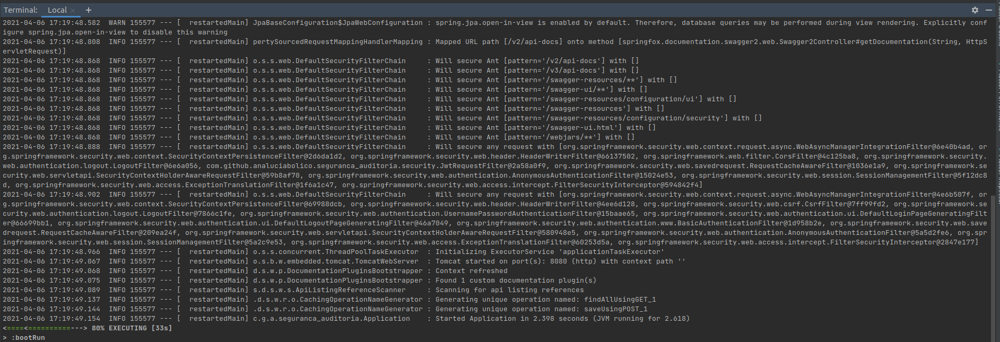

# AUTH-API
Spring Boot REST AUTH API is the application that authentication users.

---

## Este trabalho foi desenvolvido por:
ANA CLARA E ANA LUCIA

---

## Foi desenvolvido uma API simples que implementa autenticacao com Token JWT.
## Este trabalho foi desenvolvido com:
1. Linguagem JAVA
2. Framework Spring Boot
3. Framework Gradle
4. Swagger para Docmentacao da API
5. Banco de dados H2 em memoria principal - DEV.
5. Banco de dados Postgres - PRD.

### Sua autenticacao foi feita atraves da configuracao do Spring Security.
### Foi disponibilizado colecoes do [Postman](https://www.postman.com/) ou [Insomnia](https://insomnia.rest/) para testar a API
* Neste arquivo: ***/collection/auth-api.json*** 

---

### Segue aqui instrucoes de uso/instalacao para poder rodar o trabalho:
 
- Primeiro voce precisa ter Java 11 em sua maquina 
  > [Java](https://www.oracle.com/br/java/technologies/javase-jdk11-downloads.html)

- Segundo voce precisa entrar na pasta do projeto e builda-lo
````shell
cd auth-api
````

- Terceiro voce buildar o projeto
````shell
./gradlew build
````

- Quarto voce Precisa executar:
````shell
./gradlew bootRun
````

- Por fim ira aparecer uma tela semelhante a esta:



- Apos isto voce conseguiu executar todos os passos com sucesso, entao acesse [localhost](localhost:8080) para conferir.


---

Listaremos aqui todas as rotas disponiveis nessa API:
1. URL Base do Sitema: Metodo **GET** [URL base](localhost:8080)
1. Swagger para voce conseguir acessar todas as outras rotas: Metodo **GET** [Swagger](localhost:8080/swagger-ui.html)
2. Login para voce se autenticar: Metodo **POST** [Login](localhost:8080/api/login)
2. Home para voce se autenticar: Metodo **GET** [Home](localhost:8080/api/home)
